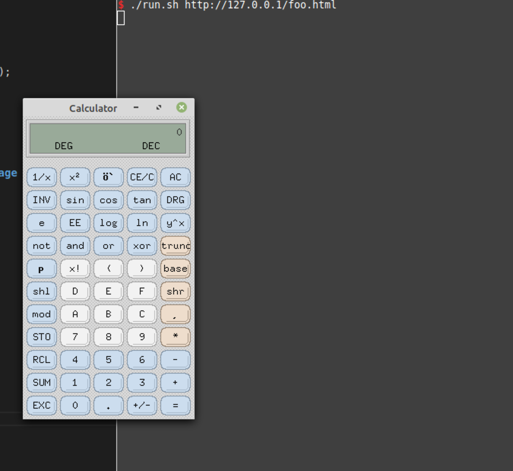
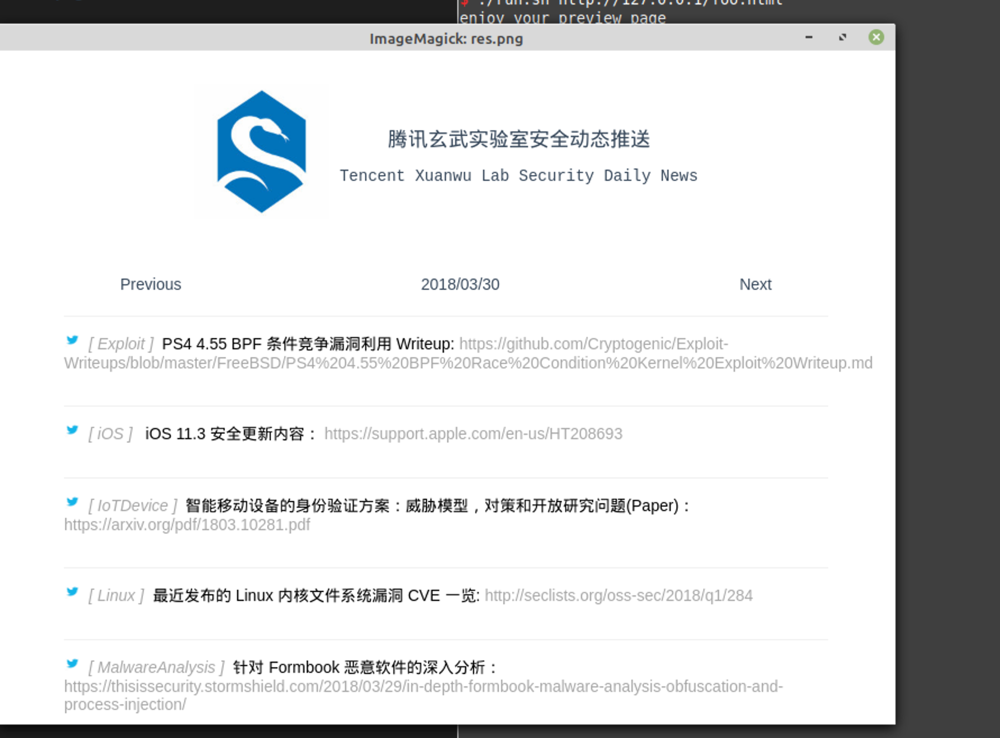
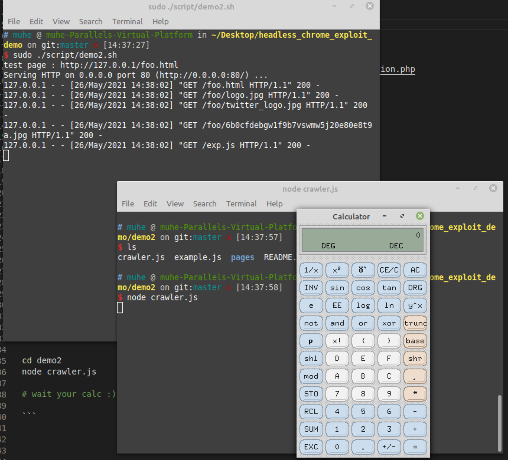

# Headless chrome exploit demo 

[my blog Chrome-headless-exploit](https://o0xmuhe.github.io/2021/05/26/Chrome-headless-exploit/)

**Exploit for FUN!**


## WHAT I NEED

Chrome M76 linux : https://www.slimjet.com/chrome/google-chrome-old-version.php


NodeJS && puppeteer

## HOW TO TEST


### test exploit 

```bash
./script/exp.sh

./chrome --no-sandbox http://127.0.0.1/exp.html
./chrome --no-sandbox --headless http://127.0.0.1/exp.html
```


### demo1


```bash

./script/demo.sh

cd demo1

./run.sh http://127.0.0.1/foo.html

# then, enjoy your calc :) 
```






### demo2


```bash
./script/demo2.sh


cd demo2
node crawler.js

# wait your calc :)

```




